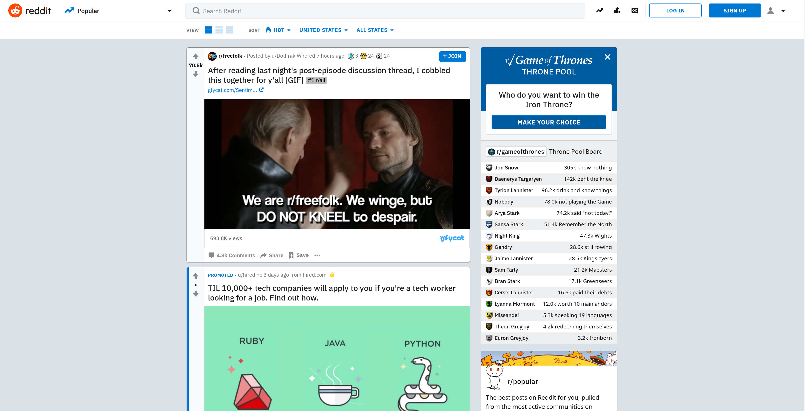

# Create a Copy of a Website Using Native HTML and CSS

## Challenge

Take a screenshot of a website and recreating it using only native HTML and CSS.

## Purpose

I have always found that styling with CSS to be one of my weaker skills. This exercise will help me improve those skills and unlock more that I can do without leaning on a styling framework just to get by

## Website to Recreate

