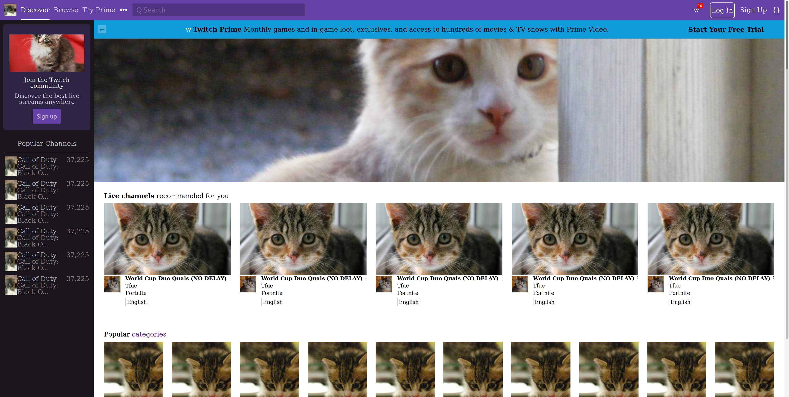

# Create a Copy of a Website Using Native HTML and CSS

## Challenge

Take a screenshot of a website and recreating it using only native HTML and CSS. Branded icons and images can be replaced by placeholder images like [placekitten](https://placekitten.com/). The positioning does not need to be pixel perfect, but rather looking professional. The point isn't to blindly copy but to improve CSS skills.

Icons can be whatever similar icons are found on the computers character viewer.

Interactivity is not being tested here, only the positioning and general look.

## Purpose

I have always found that styling with CSS to be one of my weaker skills. This exercise will help me improve those skills and unlock more that I can do without leaning on a styling framework just to get by

## Website to Recreate

## Created version

